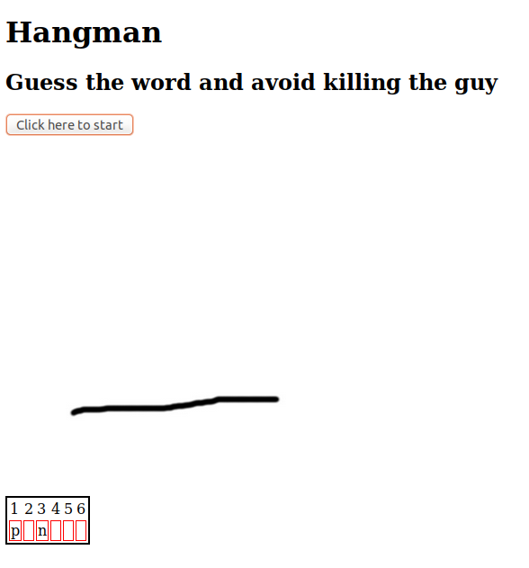

# Hangman
Little Javascript game where your bad guesses or bad spelling kill someone.

## Process and progress

Game made after two weeks of Javascript study, during the 5th week of becode.org training.

**23 September 2019:** On a click of the start button, a random word is picked, a table is shown with a maximum of two hints, and the first image of the hangman appears. The road is still dark and full of terrors. 

*Screenshot of current view*

